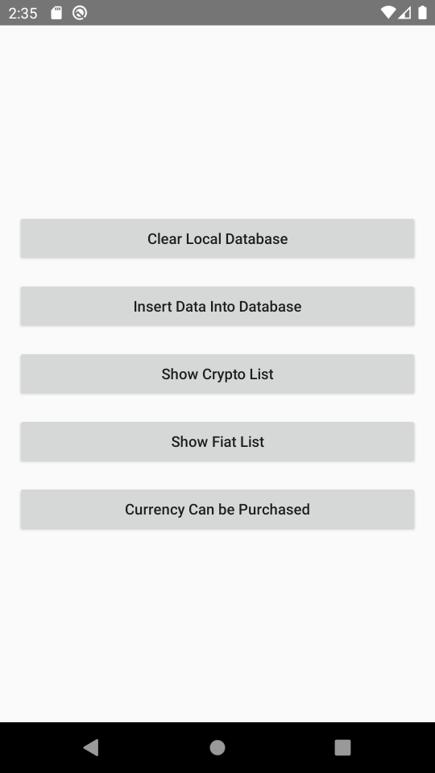
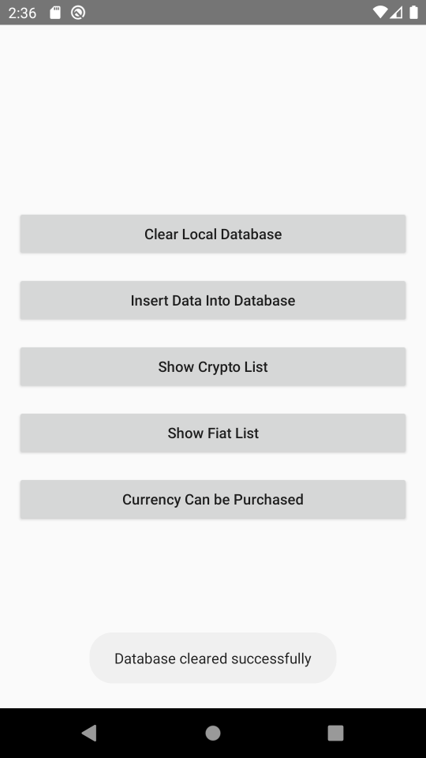
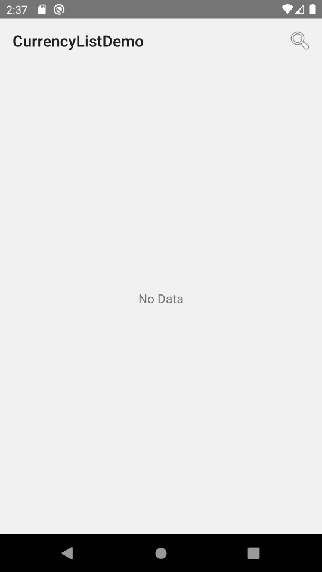
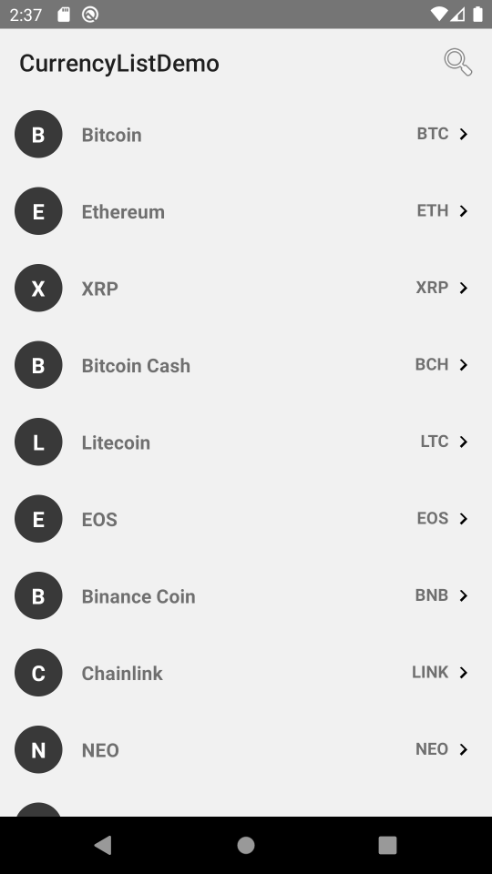
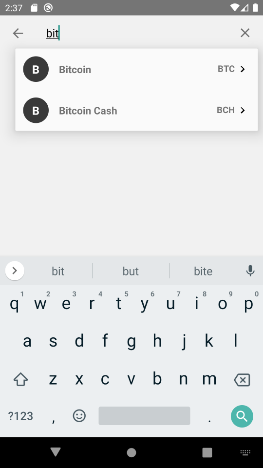
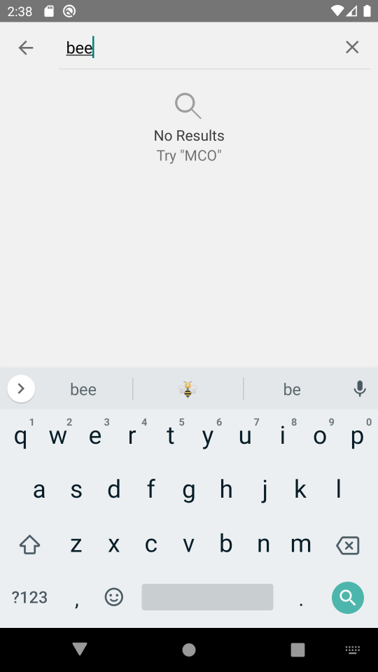
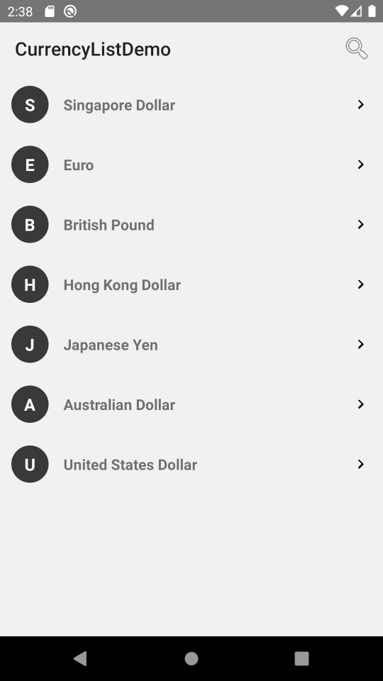

# 💸 CDC Currency List Demo

This is a simple Android demo app built with Kotlin and Jetpack components. It demonstrates how to work with local JSON assets, Room database, and a search interface with debounce using `SearchView`.

---

## 🧪 Features

- Load currencies from JSON assets into Room database
- Clear the entire database
- View lists of **Crypto**, **Fiat**, or **All** currencies
- View currencies in a dedicated fragment with optional search
- Search suggestions with live updates and debounce
- Clean Architecture with UseCases and Repository pattern

---

## 📱 Screens Overview

### 🔹 `DemoActivity`
The main entry point that provides 5 functional buttons:

1. **Load Asset JSON**: Load and insert currency data into the database
2. **Clear Database**: Deletes all existing currency entries
3. **Show Crypto List**: Opens `CurrencyListFragment` filtered by crypto
4. **Show Fiat List**: Opens `CurrencyListFragment` filtered by fiat
5. **Show All Currencies List**: Opens `CurrencyListFragment` showing all currencies

---

### 🔹 `CurrencyListFragment`
Displays a list of currencies based on the selected type (crypto/fiat/all).

- Displays suggestions while typing
- Shows empty view if no match is found
- Clicking an item is disabled in suggestion view

---

## 🛠 Tech Stack

- **Language**: Kotlin
- **Architecture**: Clean Architecture (UseCases, ViewModel, Repository)
- **UI**: XML Views, RecyclerView, SearchView
- **Persistence**: Room Database
- **Concurrency**: Kotlin Coroutines, Flows
- **Dependency Injection**: Koin


## 🧠 Architecture


```
com.cdc.currencylistdemo
├── data
│ └── local
│       └── dao
│       └── entity
│       └── repository
│       └── AppDatabase.kt
|  └── source
|        └── AssetDataSource.kt
├── domain
│ └── model
│       └── CurrencyViewModel.kt
│ └── usecase
│       └── ClearAllCurrenciesUseCase.kt
│       └── LoadCurrenciesFromAssetUseCase.kt
├── di
│ └── AppModule.kt
├── ui
│ ├── DemoActivity.kt
│ └── CurrencyListFragment.kt
└── viewmodel
│       └── CurrencyViewModel.kt
└── adapter
│       └── CurrencyAdapter.kt
│       └── CustomSuggestionAdapter.kt
```

---

## 🚀 Getting Started

1. Clone the repo
2. Open in Android Studio
3. Run the app on emulator/device
4. Use buttons in `DemoActivity` to load or view currencies

---

## 📌 Notes

- The app uses in-memory filtering for currency suggestions
- Room database will persist between sessions unless cleared manually
- Search is case-insensitive and supports partial matches on `name` and `symbol`

## 📌 Future Enhancement
- Add debounce for `SearchView`
- Use `activityViewModels` between activity and fragment, replace send bundle via instance

## 🧪 Testing

- Unit tests are available for all major use cases
- DAO can be tested with in-memory Room database

---

## 📸 Screenshots

| DemoActivity | Clear Database | Empty Screen | Crypto List
|----------------|-------------|--------------|--------------
|  |   |  | 


| Search Suggestion | Search No Result  | Fiat List
|----------------|-------------|-------------
| |  | 

## 📝 License

This project is for demo purposes only.

Made with ❤️ by [xnmalex](https://github.com/xnmalex)
